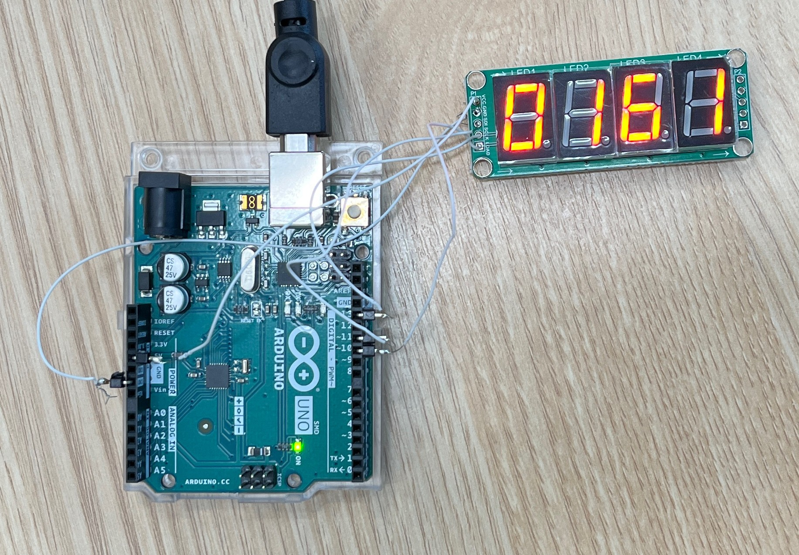
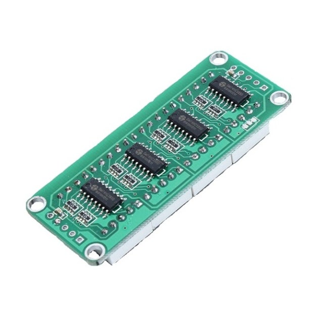
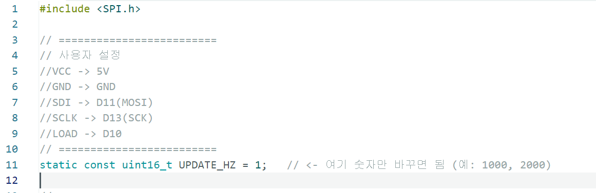
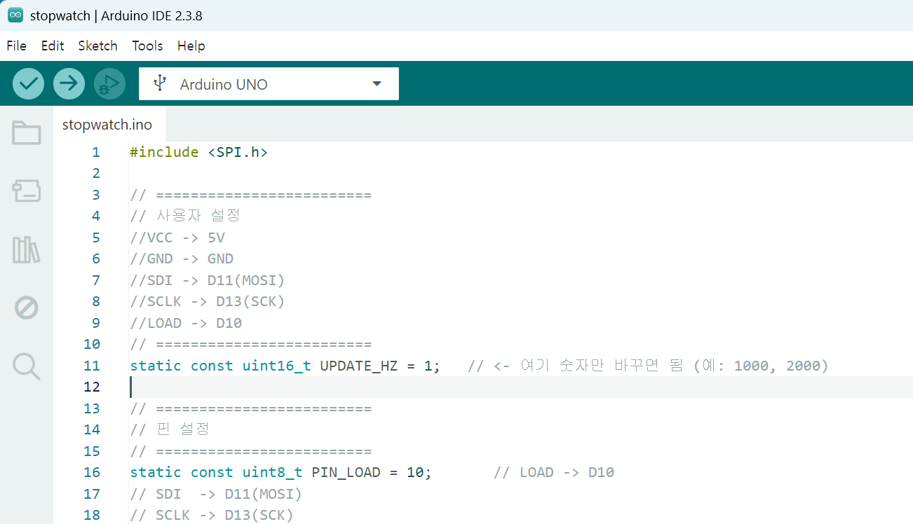

# Event Arduino Stopwatch Target

Arduino Uno와 4자리 7-segment 디스플레이를 이용한 고속 카운터 타깃입니다. 이벤트 카메라 또는 고속 카메라가 실제로 시간 순서대로 변화하는 숫자를 얼마나 잘 잡는지 확인하기 위해 만들었습니다.



## 목적

이 장치는 0000부터 9999까지 숫자를 일정한 속도로 증가시키는 작은 스톱워치 타깃입니다. 예를 들어 `UPDATE_HZ`를 `1000`으로 설정하면 표시되는 숫자가 초당 1000번 바뀝니다.

1 kHz, 2 kHz 정도로 빠르게 바뀌는 대상을 카메라로 찍어보고 싶을 때, Arduino와 4자리 7-segment만으로 가장 간결하게 만들 수 있는 방법이 이 방식입니다.

1000 fps로 촬영한다고 하는 카메라가 있다면, 이 스톱워치를 1000 Hz로 올려 둔 뒤 촬영 결과에서 숫자가 0000, 0001, 0002처럼 순서대로 이어지는지 확인할 수 있습니다. 연속적인 숫자 변화가 시간 순서대로 잡히면 카메라가 그 정도의 시간 해상도로 변화를 보고 있다고 대략적으로 판단할 수 있습니다.

이벤트 카메라의 경우에도 같은 원리로 사용할 수 있습니다. 세그먼트가 켜지고 꺼지는 변화가 이벤트로 기록되므로, 숫자가 바뀌는 순서와 이벤트 타임스탬프를 비교하면 실제 시간 해상도나 누락 여부를 대략적으로 확인할 수 있습니다.

정밀한 계측기라기보다는, 카메라가 주장하는 fps 또는 시간 해상도가 실제 촬영에서 어느 정도 보이는지 빠르게 검증하기 위한 시각적 타깃입니다. 카메라 노출 시간, 동기화 상태, LED 응답, Arduino 클럭 오차에 따라 결과에는 약간의 차이가 날 수 있습니다.

## 동작 방식

- Arduino Uno의 Timer1을 CTC 모드로 사용합니다.
- SPI로 74HC595 시프트 레지스터 4개에 데이터를 보냅니다.
- `LOAD` 핀을 올리는 순간 4자리 숫자가 동시에 갱신됩니다.
- 기본 설정은 `UPDATE_HZ = 1000`입니다.
- 실제 타이머 인터럽트는 `UPDATE_HZ * 2`로 동작합니다.
- 표시 단계와 전체 소등 단계를 번갈아 실행합니다.

즉 `UPDATE_HZ`가 `1000`일 때 내부 타이머는 2000 Hz로 돌고, 동작은 아래처럼 반복됩니다.

```text
숫자 표시 -> 전체 끔 -> 다음 숫자 표시 -> 전체 끔 -> ...
```

이렇게 한 이유는 숫자가 바뀌는 순간에 이전 세그먼트와 다음 세그먼트가 섞여 보이는 문제를 줄이고, 고속 촬영 또는 이벤트 검출에서 변화 지점을 더 분명하게 만들기 위해서입니다. 중간에 빈 화면이 잡히는 것은 의도된 동작입니다.

## 일부러 맞춘 7-segment 조건

이 프로젝트는 아무 4자리 7-segment 모듈이나 쓰는 것을 목표로 하지 않습니다. 고속 카메라 검증용 타깃으로 쓰기 위해 일부러 아래 조건을 잡았습니다.

- `74HC595 7 segment 4 digit`처럼 검색했을 때 나오는 형태의 모듈을 사용합니다.
- 74HC595 시프트 레지스터가 4개 붙어 있는 모듈을 사용합니다.
- 멀티플렉싱으로 자릿수를 빠르게 스캔하는 방식이 아니라, 각 자리의 세그먼트 상태를 유지하는 정적 구동에 가깝게 사용합니다.
- 4자리 숫자가 `LOAD` 신호에 의해 같은 순간에 바뀌어야 합니다.
- common-anode 기준으로 작성되어 있으며, 세그먼트는 LOW일 때 켜지는 조건입니다.
- 전체 소등은 모든 세그먼트를 HIGH로 보내는 방식입니다.

일반적인 멀티플렉싱 4자리 모듈은 사람이 보기에는 정상적으로 보이지만, 고속 카메라나 이벤트 카메라로 보면 자릿수가 순서대로 스캔되는 흔적, 일부 세그먼트만 보이는 현상, 잔상처럼 보이는 패턴이 생길 수 있습니다. 이 프로젝트에서는 그런 현상을 줄이기 위해 74HC595 4개가 붙은 모듈과 동시에 갱신되는 방식을 사용했습니다.

<p align="center">
  
</p>

## 핀 연결

```text
VCC  -> 5V
GND  -> GND
SDI  -> D11 / MOSI
SCLK -> D13 / SCK
LOAD -> D10
```

Arduino Uno는 USB로 컴퓨터와 연결하면 전원 공급과 업로드를 동시에 할 수 있습니다.

## 속도 변경 방법

`stopwatch.ino` 상단의 `UPDATE_HZ` 값을 바꾸면 숫자가 바뀌는 속도를 조절할 수 있습니다.

```arduino
static const uint16_t UPDATE_HZ = 1000;
```

예를 들어 1000 fps 카메라를 확인하고 싶다면 `1000`으로 둡니다. 숫자가 너무 빨라 카메라에서 건너뛰어 보이면 카메라의 실제 시간 해상도, 노출 시간, 촬영 설정을 함께 확인해야 합니다.



수정한 뒤 Arduino IDE의 업로드 버튼을 눌러 보드에 다시 올립니다.



## 파일 구성

```text
stopwatch.ino
README.md
assets/
```

Arduino 소스는 `stopwatch.ino` 하나만 사용합니다. `assets` 폴더는 README 설명용 이미지입니다.

## 사용 순서

1. Arduino Uno와 7-segment 모듈을 위 핀 연결대로 연결합니다.
2. Arduino IDE에서 `stopwatch.ino`를 엽니다.
3. 필요한 경우 `UPDATE_HZ` 값을 바꿉니다.
4. Arduino Uno 보드와 포트를 선택합니다.
5. 업로드 버튼을 눌러 보드에 기록합니다.
6. 이벤트 카메라 또는 고속 카메라가 7-segment를 정면에서 보도록 배치합니다.
7. 촬영 결과에서 숫자 증가 순서와 누락 여부를 확인합니다.

촬영 결과에서 숫자가 일정하게 증가하면 카메라가 해당 속도의 변화를 따라가고 있다고 볼 수 있습니다. 숫자가 건너뛰거나 여러 숫자가 겹쳐 보이면 카메라 fps, 노출 시간, rolling shutter, 초점, 밝기, 세그먼트 응답 등을 함께 조정해야 합니다.
